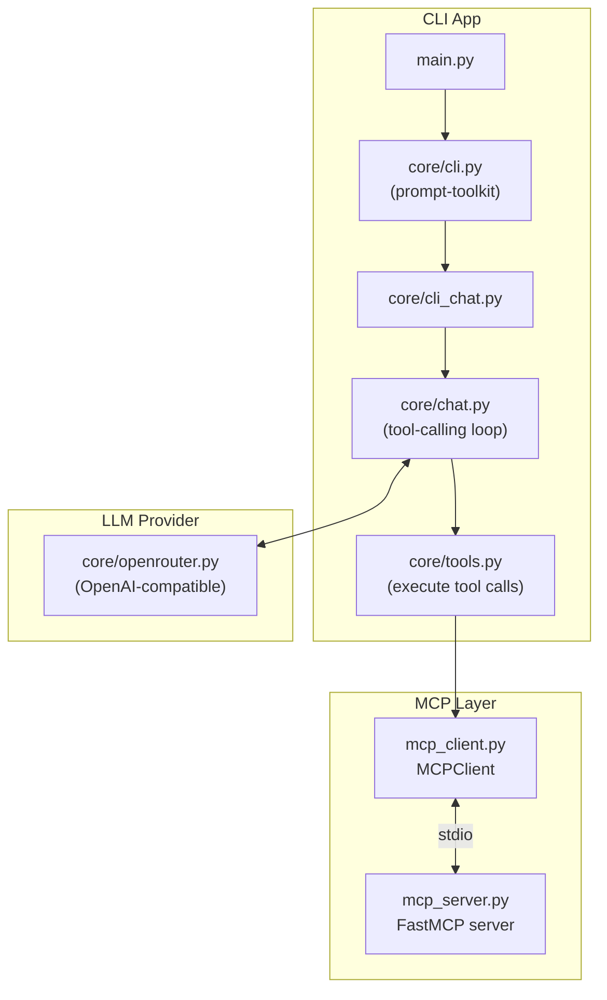
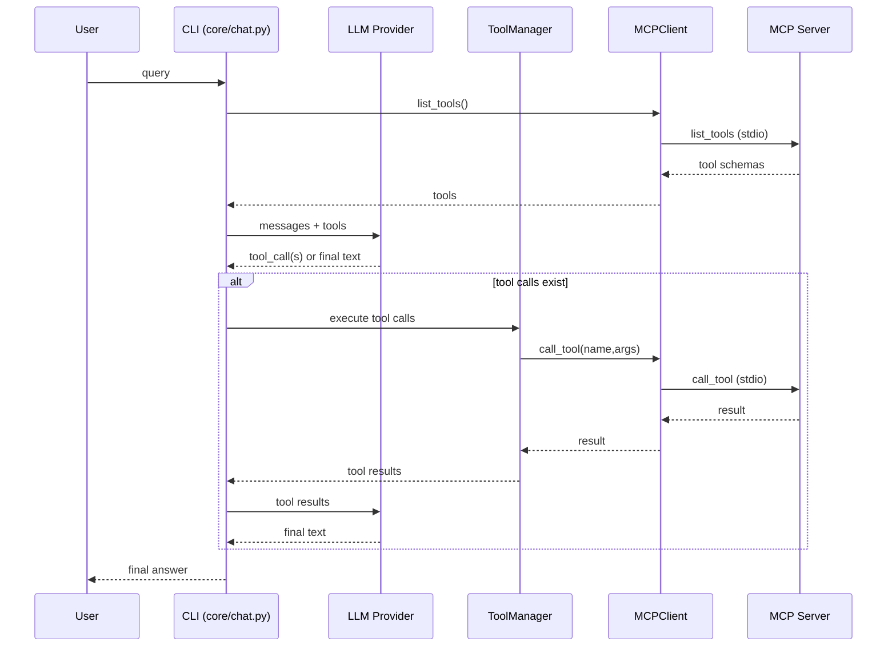

# 02 - Project Architecture (ဒီ project ရဲ့ flow)

ဒီ project ကို “**CLI Chat App + MCP Clients + MCP Servers**” ဆိုပြီး ၃ပိုင်းနဲ့မြင်ရင် နားလည်လွယ်ပါတယ်။

## Folder/Files overview (အရေးကြီးတဲ့ files)

- `main.py`
  - CLI app ကို run ပေးတဲ့ entrypoint
  - MCP server ကို spawn လုပ်ပြီး `MCPClient` နဲ့ session ဖွင့်တယ်
  - LLM provider (OpenRouter) ကို set up လုပ်တယ်
- `mcp_server.py`
  - MCP server (FastMCP) implementation
  - tools ၂ခု register လုပ်ထားတယ်
  - transport = `stdio`
- `mcp_client.py`
  - MCP client wrapper
  - stdio transport နဲ့ server process spawn + `ClientSession` open
- `core/cli_chat.py`
  - user query ကို process
  - `@doc_id` mentions တွေကို resource read လုပ်ပြီး context ထည့်ပေးမယ် (resource server TODO)
  - `/command doc_id` ဆို prompt get လုပ်မယ် (prompt server/client TODO)
- `core/chat.py`
  - provider-agnostic chat loop
  - MCP tools list → LLM ကို tool schema ပို့ → LLM tool call တောင်းရင် execute → tool results ပို့
- `core/tools.py`
  - tool call execution logic (tool name နဲ့ client ရှာ → call_tool → result normalize)
- `core/openrouter.py`
  - OpenAI-compatible tool calling format ကို MCP tool schema ကနေ ပြောင်းပေးတာပါ

## High-level flow (စာကြောင်းလိုက်)

1. `main.py` က env ထဲက `LLM_MODEL`, `LLM_API_KEY` ကိုယူပြီး LLM provider (`OpenRouterProvider`) ကိုတည်ဆောက်တယ်
2. `main.py` က doc MCP server ကို subprocess အဖြစ် run လုပ်ပြီး `MCPClient` နဲ့ connect လုပ်တယ်
3. `CliApp` (prompt-toolkit) က user input ကိုယူပြီး `CliChat.run()` ကိုခေါ်တယ်
4. `core/chat.py` က
   - MCP tools တွေကို clients အားလုံးကနေ list လုပ်တယ်
   - tool schema ကို LLM provider format နဲ့ ပို့တယ်
5. LLM က tool call မလိုရင် final text answer ထုတ်ပေးပြီး CLI print လုပ်တယ်
6. LLM က tool call တောင်းရင် `ToolManager.execute_tool_calls()` က MCP client ကနေ tool call လုပ်ပြီး result ကို LLM ဆီပြန်ပို့တယ်
7. tool call loop ပြီးတဲ့အထိ ထပ်ခေါ်ပြီး နောက်ဆုံး final answer ရလာတဲ့အခါ print လုပ်တယ်

## Mermaid diagram (System overview)

## “MCP + LLM tool calling” ချိတ်ဆက်ပုံကိုသိဖို့

ဒီ project က “**MCP tools**” ကို “**LLM function calling tools**” အဖြစ် map လုပ်ထားပါတယ်။

- MCP server က tools ကို expose လုပ်တယ်
- MCP client က `list_tools()` လုပ်ပြီး tool name/description/inputSchema ကိုယူတယ်
- LLM provider (`core/openrouter.py`) က inputSchema ကို OpenAI tool schema အဖြစ် ပြောင်းပေးတယ်
- LLM က tool call တွေထုတ်လိုက်ရင် MCP client က tool ကို execute လုပ်ပေးတယ်

## Mermaid diagram (Tool calling loop)

## Known gaps (ဒီ project ရဲ့ TODO)

ဒီ codebase မှာ **Resources** နဲ့ **Prompts** ကိုအသုံးချမယ့် code path ကရှိပြီးသားပါ—

- CLI ထဲမှာ `@doc_id` mention → resource read
- CLI ထဲမှာ `/command doc_id` → prompt get

ဒါပေမယ့် `mcp_server.py` + `mcp_client.py` မှာ resources/prompts ကိုမပြီးသေးတဲ့အတွက် **Page 06** မှာ “ဘယ်လိုဖြည့်ရေးမလဲ” ကို လက်တွေ့အဆင့်လိုက်လုပ်ပြထားပါတယ်။

