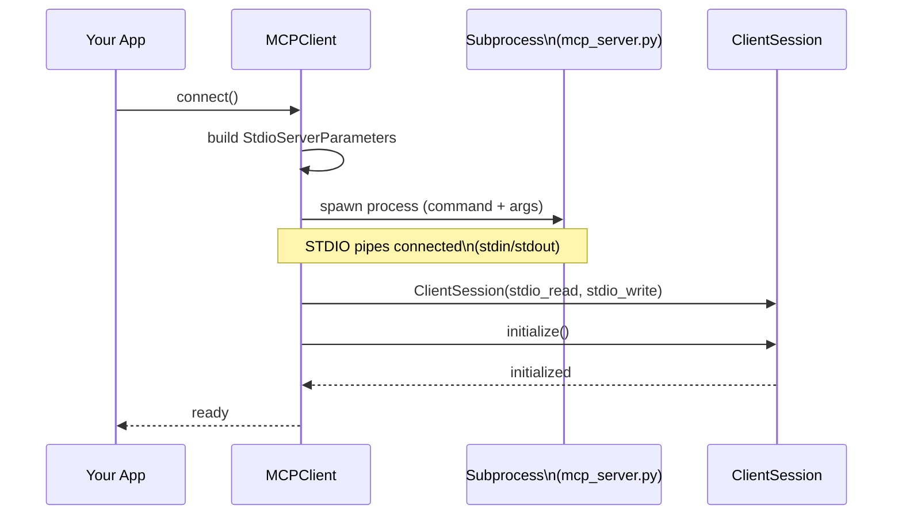

# 04 - MCP Client (STDIO) ကိုနားလည်ခြင်း

ဒီ project ထဲက MCP client wrapper က `mcp_client.py` ပါ။ Server ကို “local subprocess” အဖြစ် run လုပ်ပြီး STDIO နဲ့ MCP session ဖွင့်ပေးပါတယ်။

## Client ရဲ့ အဓိကတာဝန်

- Server process ကို spawn လုပ်ပြီး `ClientSession` တစ်ခုတည်ဆောက်မယ်
- MCP handshake/initialize လုပ်မယ်
- `list_tools()`, `call_tool()` စတာတွေကို abstraction အနေနဲ့ပေးမယ်
- lifecycle cleanup (`AsyncExitStack`) နဲ့ resource leak မဖြစ်အောင်ပိတ်မယ်

## `MCPClient` class structure

```python
class MCPClient:
    def __init__(self, command: str, args: list[str], env: Optional[dict] = None):
        self._command = command
        self._args = args
        self._env = env
        self._session: Optional[ClientSession] = None
        self._exit_stack: AsyncExitStack = AsyncExitStack()
```

**ဘာကိုသတိထားမလဲ**

- `command` / `args`: server ကို run ဖို့ (ဥပမာ `uv run mcp_server.py` သို့ `python mcp_server.py`)
- `env`: server subprocess အတွက် env variables
- `AsyncExitStack`: async context managers (transport + session) ကိုစုပေါင်း manage လုပ်ဖို့

## `connect()` မှာ အရေးကြီးတဲ့ ၃ချက်

```python
async def connect(self):
    server_params = StdioServerParameters(command=self._command, args=self._args, env=self._env)
    stdio_transport = await self._exit_stack.enter_async_context(stdio_client(server_params))
    _stdio, _write = stdio_transport
    self._session = await self._exit_stack.enter_async_context(ClientSession(_stdio, _write))
    await self._session.initialize()
```

- **(1) `StdioServerParameters`**: server run command ကို wrap လုပ်တယ်
- **(2) `stdio_client(...)`**: subprocess + stdio transport stream တွေကိုဖန်တီးတယ်
- **(3) `ClientSession.initialize()`**: MCP handshake (capabilities/tools/etc) အတွက် initialize

## Mermaid diagram (STDIO connection + session)



## Tools list/call

ဒီ project မှာ tools ပိုင်းက ready ပါ—

```python
async def list_tools(self) -> list[types.Tool]:
    result = await self.session().list_tools()
    return result.tools

async def call_tool(self, tool_name: str, tool_input: dict) -> types.CallToolResult | None:
    return await self.session().call_tool(tool_name, tool_input)
```

**LLM tool-calling integration** ကတော့ `core/tools.py` မှာ ဒီ method တွေကိုခေါ်ပြီး results ကို normalize လုပ်ပေးပါတယ်။

## Async context manager (`async with MCPClient(...)`)

```python
async def __aenter__(self):
    await self.connect()
    return self

async def __aexit__(self, exc_type, exc_val, exc_tb):
    await self.cleanup()
```

ဒါကြောင့် `main.py` မှာ—

- connect/cleanup ကို manual မလုပ်ဘဲ
- `AsyncExitStack` ထဲကနေ client lifecycle ကိုသေချာပိတ်နိုင်ပါတယ်

## Project ထဲက TODO (Prompts/Resources)

Client မှာ ဒီ method တွေက placeholder လုပ်ထားပါတယ်—

- `list_prompts()`
- `get_prompt()`
- `read_resource()`

CLI flow (`core/cli_chat.py`) က ဒါတွေကိုခေါ်ပြီးသုံးဖို့ရေးထားတာကြောင့် **Page 06** မှာ server/client နှစ်ဘက်လုံးကို ဘယ်လိုဖြည့်ရေးမလဲကို လက်တွေ့အဆင့်လိုက် ပြထားပါတယ်။

## Windows note

`__main__` မှာ Windows event loop policy ကို set လုပ်ထားပါတယ်—

```python
if sys.platform == "win32":
    asyncio.set_event_loop_policy(asyncio.WindowsProactorEventLoopPolicy())
```

STDIO subprocess နဲ့ asyncio တွဲသုံးတဲ့အခါ Windows မှာ compatibility အတွက် ဒီ setting ကအသုံးဝင်ပါတယ်။

