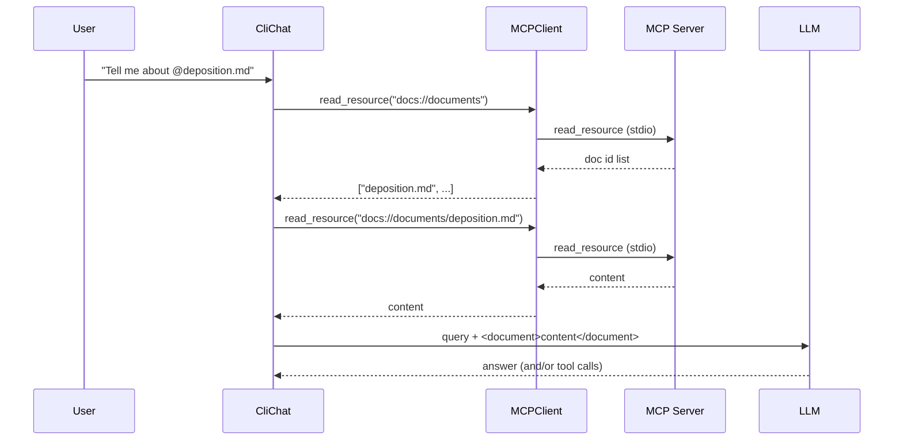
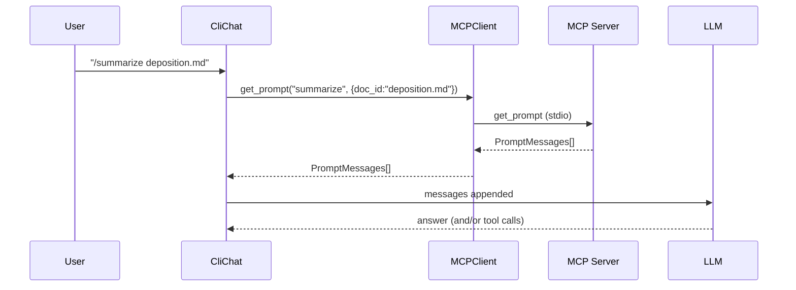

# 05 - CLI Chat Flow ( `@docs` , `/commands` , tool-calls )

ဒီ page က “ဒီ project က MCP tools/resources/prompts ကို CLI experience ထဲမှာ ဘယ်လိုချိတ်ထားလဲ” ကို diagram နဲ့အတူရှင်းပါတယ်။

## Mermaid diagram (User input အမျိုးအစား ၃မျိုး)

```mermaid
flowchart TD
  Q[User input] -->|Normal chat| N[LLM chat only]
  Q -->|@doc mention| R[Resource flow\n(docs://...)]
  Q -->|/command| P[Prompt flow\n(get_prompt)]

  R --> C1[Insert doc content\ninto LLM context]
  P --> C2[Insert prompt messages\ninto conversation]
  N --> L[LLM]
  C1 --> L
  C2 --> L

  L -->|may request tool calls| T[Tool calling loop]
```

## `@doc_id` mentions → Resource flow

`core/cli_chat.py` မှာ `@something` လို့မြင်ရင် mention list ကိုစုပါတယ်။ ပြီးရင် resources ကနေ doc ids/content ကိုဖတ်ပြီး prompt context ထဲထည့်ပေးပါတယ်။

**Expected resource URIs (ဒီ project design)**:

- `docs://documents` → `["deposition.md", "report.pdf", ...]`
- `docs://documents/<doc_id>` → `"document contents ..."`



## `/command doc_id` → Prompt flow

`/summarize deposition.md` လို input မျိုးကို CLI က command အဖြစ်သတ်မှတ်ပြီး server-defined prompt messages ကိုယူပြီး conversation ထဲထည့်ပါတယ်။



## Tool calling loop

Tool calling loop ကို `core/chat.py` ကထိန်းပြီး `core/tools.py` က tool name အလိုက် client ကိုရှာပြီး `call_tool(...)` ခေါ်ပေးပါတယ်။ (အပြည့်အစုံ diagram ကို `docs/02-project-architecture.md` မှာထည့်ထားပါတယ်)

